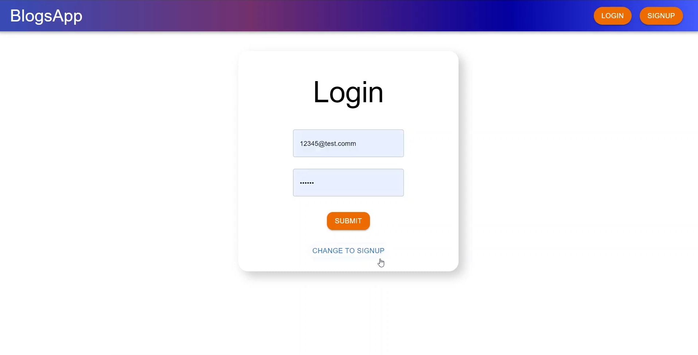
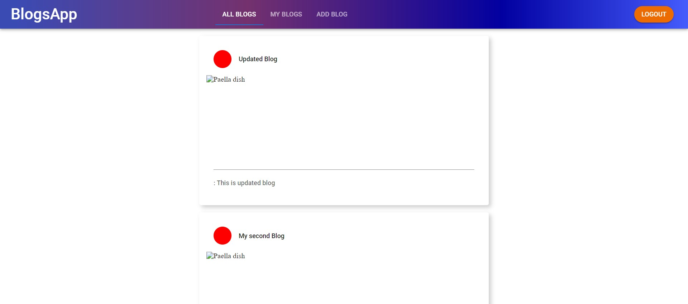
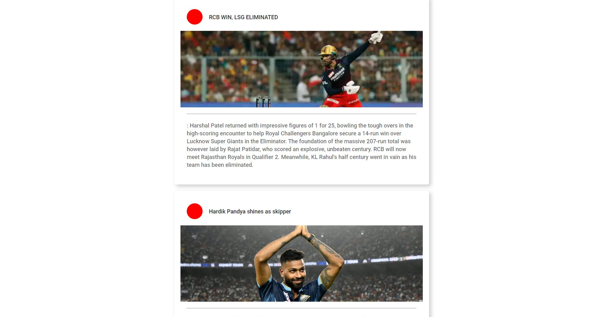
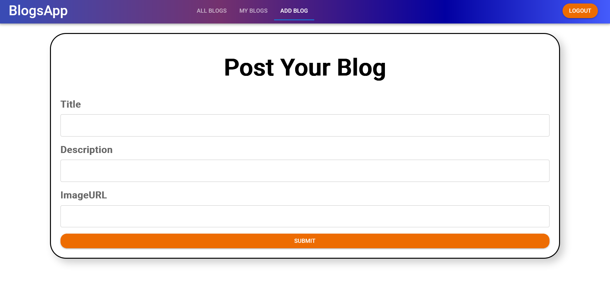
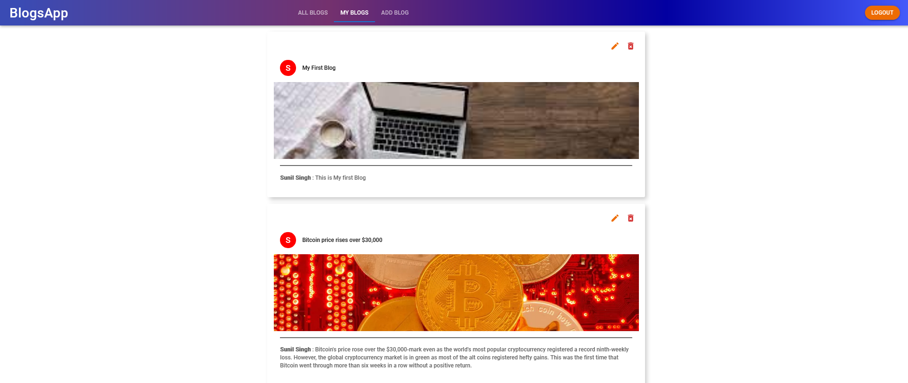

# MERN-Blog

## Table of contents

- [Introduction](#introduction)
- [Demo](#demo)
- [Features](#features)
- [Technology](#technology)
- [Database Models](#database)

## Introduction

A virtual blog application using the MERN stack (MongoDB, Express js, React js, and Node js).

## Demo

## Technology

The main technologies used to build this application are:

- Node.js version 14.16.0
- MongoDB version 4.4.3
- Express.js version 4.17.1
- React.js version 17.0.1
- Antd, a React UI Framework, version 4.12.3

## Features

A blog app with the following features.

Users can do the following:

- Signup.
- Login or logout.
- Create a new post.
- View/Edit/delete/like posts.

## Database

All the models can be found in the models directory created using mongoose.

### User Schema:

- userName (String)
- email (String)
- password (String)
- summary (String)
- imagePath (String)

### Post Schema:

- title (String)
- content (String)
- imagePath (String)

